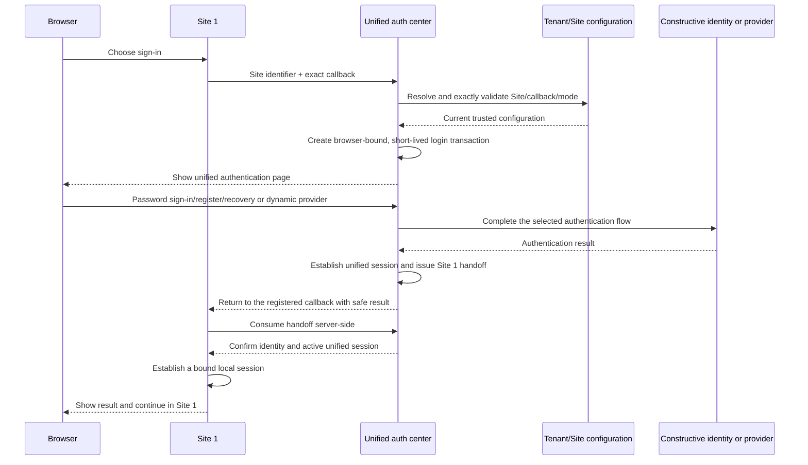
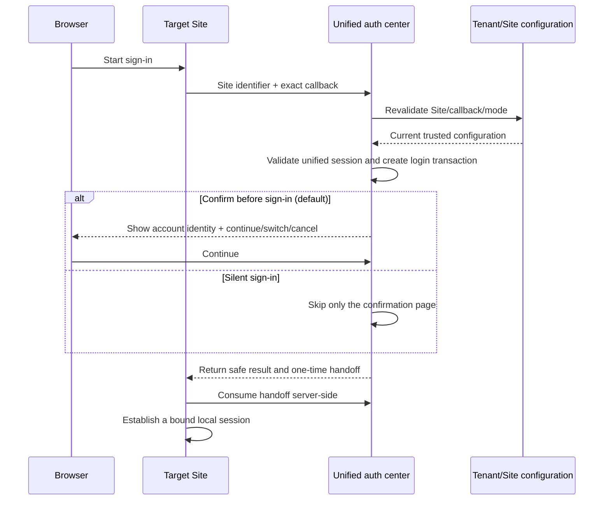

# OAuth and Cross-Domain SSO Requirements

## Purpose

Constructive must provide a complete OAuth sign-in experience and a unified
SSO entry point for applications that may live on different parent domains.

This document defines the final CNC behavior. The work may be delivered through
several package-focused changes, but those changes must converge on the same
requirements rather than becoming independent OAuth implementations.

Dashboard hosts the unified authentication pages, branding, and browser
interaction. Unified authentication is an independent platform capability: it
must continue to work without entering or depending on Dashboard's database,
organization, or other management features.

## User outcome

A user can select an OAuth provider configured by the current tenant, complete
the provider's authentication flow, and return to the application as the same
Constructive user on every subsequent login.

After authenticating through the unified auth entry, the user can establish a
session on another registered Constructive application even when that
application uses a different parent domain. The user must not need to repeat
the upstream provider login while the unified authentication session remains
valid and applicable policy permits SSO.

Creating an account through OAuth authenticates an identity; it does not grant
tenant roles, schema access, API access, or data permissions. Existing
Constructive authorization remains authoritative.

The unified authentication page always offers Constructive account/password
sign-in, registration, and password recovery. In the initial release, successful
local account/password registration immediately establishes the browser's
unified authentication session and continues the originating Site login flow.
Email verification is not a prerequisite for that session or later password
sign-in.

## Tenant, Site, and callback registration

A Tenant manages the Sites that may use unified authentication.

- Each Site has a stable Site identifier within its Tenant.
- A Site may register multiple allowed callback URLs.
- Each callback URL is registered individually and matched exactly, including
  scheme, host, port, path, and any registered fixed components.
- Wildcards, parent-domain suffix matching, similar hostnames, and temporary or
  request-supplied callback URLs are not trusted.
- Browser-supplied Site identifiers and callback URLs are request inputs only.
  They become trusted targets only after exact validation against current Tenant
  configuration.
- A disabled Site or removed callback cannot start a new login transaction.
  The Site and callback are revalidated before the final result or handoff is
  issued, so an in-progress flow fails safely after reassignment or removal.

Each Site has one Tenant-managed authentication mode:

- **Confirm before sign-in (default):** when the browser already has a valid
  unified session, the authentication center shows a lightweight account
  confirmation page before issuing a Site handoff.
- **Silent sign-in:** when the browser has a valid unified session and no other
  interaction is required, the center may complete the handoff without showing
  the confirmation page.

An absent mode always resolves to confirm before sign-in. A request parameter,
Site type, or historical behavior cannot enable silent sign-in.

## Provider requirements

Provider availability is registry- and configuration-driven.

- Every provider exposed by the `packages/oauth` provider registry must use the
  common OAuth flow. The current registry contains Google, GitHub, Facebook,
  and LinkedIn.
- A tenant sees and can use exactly the supported providers that it has enabled
  and configured.
- An unconfigured or disabled provider is not advertised and cannot be used.
- Adding another provider to the package registry must not require a separate
  server workflow or provider-specific route design.
- Provider adapters may describe endpoint, request encoding, token-endpoint
  authentication, and profile-normalization differences, but they must not
  create separate state, PKCE, callback, identity, or session workflows.
- Unsupported provider capabilities or token authentication methods fail
  explicitly; they must not silently downgrade the security flow.
- Provider credentials and metadata are resolved for the current tenant and
  database. There is no platform default, cross-tenant, or old-version fallback.

Provider discovery is exposed through GraphQL. The old HTTP provider-list or
landing endpoint is not part of the target API. The unified authentication page
reads the current Tenant's enabled providers through the existing registry and
configuration surfaces; page code must not contain a fixed provider list.

## Unified authentication experience

The unified authentication page always provides:

- Constructive account/password sign-in;
- Constructive account registration;
- Constructive password recovery; and
- the third-party providers currently enabled and configured for the Tenant.

When confirmation is required, the page displays only the current account's
basic identifying information, such as name and avatar, together with:

- continue;
- switch account; and
- cancel.

The confirmation page is not a verbose permissions or authorization-consent
page. Site roles, permissions, and data access remain owned by existing
Constructive authorization.

The browser enters through a canonical unified-auth initiation surface with a
Site identifier, exact callback URL, and public correlation values. Exact public
route names are not fixed by this requirements document.

## OAuth flow requirements

- OAuth is an explicitly enabled server capability and is disabled by default.
- When disabled, provider discovery returns no providers and browser OAuth
  initiation/callback routes are not mounted.
- Enabling OAuth requires valid server configuration at options/startup time.
- Before any authentication begins, the center validates the Site and exact
  callback against current Tenant configuration and creates a short-lived,
  single-use login transaction bound to that Site, callback, and browser.
- Every provider uses Authorization Code flow with S256 PKCE.
- Each initiation creates a one-time verifier/challenge pair. The verifier is
  never placed in a redirect URL and is bound to the corresponding callback.
- OAuth state is signed, short-lived, and bound to the login transaction,
  provider, Tenant, database, Site, exact callback, originating API/host,
  browser, and PKCE relation.
- The callback re-resolves the current route and target application. Any
  expired, modified, replayed, or mismatched state, provider, tenant, database,
  Site, callback, browser, host, API, or PKCE value is rejected.
- Return targets must be registered and validated. Open redirects are forbidden.
- Provider authorization, token, and user-info endpoints must use HTTPS and
  reject loopback, private, link-local, and reserved network destinations.
- Server-to-provider requests use bounded timeouts and do not automatically
  follow redirects.
- Provider token and profile responses are strictly validated before use and
  normalized to the minimum identity data required by the owned database
  contract. Raw provider payloads are not persisted.

The browser HTTP surface is limited to semantics that GraphQL cannot replace:
authorization initiation, provider callback, and the redirects or cookie
operations required to complete authentication.

When the login transaction and target remain trusted, OAuth provider rejection
and safely classified callback failure return a registered result to the
validated Site callback. A failure that breaks target trust remains at the
authentication center as defined below. Raw provider error fields are not
forwarded. Every failed callback performs the same transient-state cleanup and
partial-work rollback as a successful callback.

## Login transaction and result routing

The exact Site/callback allowlist is the trust root for browser return routing.
Validation must happen before creating a login transaction, not after
authentication has already completed.

The authentication-center server stores the login transaction. The browser
holds only an opaque, cryptographically random transaction identifier; it does
not carry transaction contents, credentials, tokens, Site trust data, or other
sensitive state.

The server-side transaction is short-lived and single-use. It binds the Tenant,
Site, exact callback, and current browser. Every confirmation action, provider
callback, authentication result, handoff issuance, and handoff consumption must
match the same live, unused transaction.

When the transaction, Site, and callback remain trusted, the same registered
Site callback may receive:

- **success:** an opaque, short-lived, single-use handoff code for server-side
  consumption;
- **user cancellation:** a stable cancellation result without a handoff; or
- **a safely classified failure:** a registered, non-sensitive result category.

The Site owns the presentation of these results on its callback page. The
callback never receives raw provider errors, provider authorization or access
tokens, Constructive access/session tokens, cookies, secrets, provider payloads,
or user-sensitive data.

If the login transaction is expired or used, state or callback binding is
modified, browser binding does not match, or the center cannot prove a trusted
target Site, the browser stays at a generic authentication-center failure page.
The center must not attempt a best-effort redirect using untrusted request data.

## Browser and session security

- The authentication center and every Site use only first-party session cookies
  within their own host or explicitly configured local-domain boundary. The
  design does not depend on third-party cookies or cookies shared across
  unrelated parent domains.
- Login, unified-session, and Site-session cookies are transmitted only over
  HTTPS, marked `Secure` and `HttpOnly`, restricted from unnecessary
  cross-site sending through an appropriate `SameSite` policy, and combined
  with the existing CSRF protections.
- Cookie domain, path, and lifetime are scoped as narrowly as the owning flow
  permits. Tenant configuration cannot broaden or weaken required protections.
- OAuth state and PKCE cookies are short-lived, `HttpOnly`, narrowly scoped,
  and cleared on callback success and failure.
- OAuth responses prevent caching and referrer leakage. Shared request logging
  redacts `/auth/*` query strings containing codes, state, or provider errors.
- A stale or existing application session must not change the pre-authentication
  privilege boundary used for identity lookup, linking, or session creation.
- OAuth and SSO do not bypass the target application's existing CORS or CSRF
  enforcement. Redirect validation, CORS, and CSRF remain separate controls.
- A login transaction and handoff are rejected after expiry, use, replay, or
  copying to another browser, Site, callback, Tenant, API, or database.
- The initial release does not provide a browser-session experience when the
  user disables all cookies. This is distinct from third-party-cookie blocking:
  the supported flow continues to use each domain's own first-party cookies.
- Trusted-device cookies must not receive a broader domain scope merely because
  SSO is enabled; any trusted-device participation requires an explicit policy.

## Identity lifecycle

- On first login, an unknown provider identity creates one Constructive user
  and one provider-identity association.
- Repeated login with the same provider identity returns the originally linked
  user and never creates a duplicate user or duplicate association.
- Provider subject/identity is the association key.
- Provider email verification is retained as metadata but does not block first
  login and does not authorize automatic account merging, recovery, or access.
- Identity creation and linking must be atomic: a failed flow must not leave a
  partial user or association.

Provider-owned MFA is completed by the provider. If the tenant's existing
Constructive policy requires local MFA, OAuth authentication continues into the
existing local MFA challenge before the final application session is created.

### Constructive local accounts

- Account/password sign-in, registration, and password recovery are permanent
  unified-auth page capabilities and do not depend on third-party provider
  configuration.
- Successful local authentication enters the same unified-session, Site-mode,
  handoff, and Site-local-session lifecycle as third-party authentication.
- In the initial release, successful account/password registration immediately
  establishes the unified session and continues the originating Site's login
  transaction.
- Email verification is not required before establishing that session or
  signing in later with the account/password credential.

## Unified SSO requirements

- The authentication entry and target application may use unrelated parent
  domains.
- Cross-domain SSO must not depend on a shared parent-domain cookie.
- The unified auth entry maintains a central session for the current browser.
  Each target Site maintains its own first-party local session cookie according
  to the browser and session security requirements above.
- Authentication may be handed from the unified entry to a verified target
  only through a short-lived, replay-resistant, server-consumed exchange.
- Reusable access tokens, session tokens, provider tokens, authorization codes,
  secrets, and user details must not be exposed in redirect URLs or fragments.
- The target host, API, tenant, and database are revalidated before a target
  session is established.
- A handoff issued for one host, API, tenant, or database cannot be consumed by
  another.
- Each Site-local session is bound to the unified session that established it.
  Every protected Site request validates that the bound unified session remains
  active. Revoking the unified session causes old Site-local sessions to be
  rejected even when their local cookies have not naturally expired.

The exact persistence and database procedure used for the handoff are design
decisions, but the observable security behavior above is required.

Route removal or reassignment during an in-progress login fails safely. Similar
hostnames, parent-domain suffixes, CORS allowlists, client-supplied database IDs,
and default-database routing do not establish SSO trust.

### Current-browser logout

- Unified logout revokes the current browser's unified session and the authority
  of every Site-local session bound to it.
- Sessions in other browsers are outside this operation's scope.
- Sites reject bound local sessions on the next protected request after central
  revocation.
- Revocation does not depend on Site logout callback URLs, browser redirects to
  every Site, or per-Site notification webhooks.

### Switch account

Switching from account A to account B first performs current-browser unified
logout for account A. The current Site then completes the active login
transaction for account B and establishes a B Site-local session. Other Sites
remain signed out. When the user later visits another Site, that Site follows
its Tenant-configured confirmation or silent mode to establish a new B session.

Account switching does not preserve usable A Site sessions and does not
background-sign-in every Site as B.

## Product interaction sequences

### Site 1 starts without a unified session



If the user cancels or a safely classified failure occurs while the target is
still trusted, the center returns the corresponding safe result to the same
registered Site 1 callback.

### A Site starts with an existing unified session



Silent sign-in skips only the confirmation UI. It never skips Site/callback
validation, transaction creation, unified-session validation, handoff, or local
session binding.

### Switch from account A to account B

```mermaid
sequenceDiagram
    participant U as Browser
    participant S1 as Current Site
    participant A as Unified auth center
    participant SO as Other Sites

    U->>A: Select switch account
    A->>A: Revoke the browser's account A unified session
    U->>A: Authenticate account B
    A-->>S1: Issue B handoff for the current transaction
    S1->>S1: Establish B local session
    Note over SO: Old A local sessions are rejected; no B session is created
    U->>SO: Visit later
    SO->>A: Start a new Site transaction
    A-->>SO: Confirm or silently establish B according to Site mode
```

## Administrative management

- An authorized administrator can create, update, enable, and disable tenant
  provider configuration and rotate its client secret through the existing
  owned configuration surface.
- A Tenant administrator can create, update, enable, and disable Sites; manage
  each Site's stable identifier and multiple exact callback URLs; and select
  confirm-before-sign-in or silent sign-in.
- New Sites default to confirm before sign-in.
- Secret values are accepted only through the secret-management boundary and
  are never returned by provider configuration reads.
- Known configuration writes and secret rotations invalidate the relevant
  runtime cache after a successful write. External changes have a defined,
  bounded staleness period and do not require a server restart.
- Provider and auth-setting writes preserve authorization, validation, audit,
  and failure semantics; a new OAuth-specific admin REST surface is not required.

## Configuration and secret boundaries

- Server/platform OAuth settings are owned and validated by `graphql/env`.
- Tenant provider metadata is owned by tenant configuration.
- Tenant provider secrets use the existing internal-secrets lifecycle; OAuth
  does not store a second secret copy.
- Middleware consumes validated options and request-scoped configuration. It
  does not read `process.env` directly.
- Secrets and raw provider errors never enter browser responses, redirect
  parameters, ordinary configuration APIs, or logs.

## Errors and observability

- Public failures use registered, stable `UPPER_SNAKE_CASE` business error
  codes rather than package, route, middleware, or internal class names.
- Security validation failures identify the rejected business object without
  exposing sensitive values or database details.
- Every caught exception is deliberately mapped to a domain/protocol failure or
  rethrown with its cause preserved. Logging is not a substitute for failure.
- Logs may include safe request, provider identifier, tenant, API, and error
  classification context, but never credentials, tokens, cookies, codes, or
  provider response bodies.

## Protocol boundary

The required protocol is OAuth 2.0 Authorization Code with mandatory S256 PKCE.
The implementation must not claim complete OpenID Connect verification unless
issuer, audience, nonce, discovery, and JWKS validation are separately defined
and implemented. Provider-specific OIDC-shaped profile responses do not by
themselves make CNC an OIDC provider or a complete OIDC relying party.

## Completion criteria

The CNC implementation is complete when:

1. All providers registered by `packages/oauth` follow the same secure flow and
   tenant configuration controls their availability.
2. Dashboard can host the unified-auth pages without making authentication
   depend on its management features.
3. Tenant-managed Sites support stable identifiers, multiple exactly matched
   callbacks, and confirm-before-sign-in by default or explicit silent sign-in.
4. The unified page always offers Constructive sign-in, registration, and
   password recovery, and obtains third-party providers dynamically.
5. Successful local account registration immediately establishes the unified
   session and continues the originating Site flow without an email-verification
   prerequisite.
6. First and repeated provider login satisfy the identity lifecycle requirements.
7. Unified SSO establishes sessions across registered applications on different
   parent domains without exposing reusable credentials.
8. Tenant/Site/callback/database/host boundaries are enforced during initiation,
   callback, identity resolution, and target-session establishment.
9. OAuth-disabled, missing configuration, provider rejection, malformed state,
   replay, routing mismatch, linking failure, and local MFA continuation have
   explicit behavior and automated coverage at their owning layers.
10. Success, cancellation, and safely classified failure can return to the same
    still-trusted callback without exposing raw provider or sensitive data;
    untrusted-target failures remain at the authentication center.
11. Login transactions are stored server-side, while the browser receives only
    an opaque random identifier with no transaction contents or sensitive state.
12. Login transactions and handoffs are short-lived, single-use, and bound to
    the correct browser, Site, callback, Tenant, API, and database.
13. The auth center and Sites use only narrowly scoped, protected first-party
    session cookies and retain the existing CSRF boundary; neither third-party
    cookies nor cross-parent-domain cookie sharing are required.
14. Endpoint validation, transient-cookie cleanup, cache/referrer protection,
   safe provider failure, and stale-session privilege boundaries are tested.
15. Current-browser logout causes every bound Site-local session to be rejected
    on protected requests, and account switching establishes the new account
    only for the currently active Site transaction.
16. Tenant provider changes and secret rotation take effect through the owned
   cache/invalidation lifecycle without leaking the secret.
17. No private identity table, parallel configuration reader, parallel request
   context, or duplicated OAuth workflow is introduced by server middleware.

## Technical details still to design

The following implementation choices remain open but must preserve the required
observable behavior:

- login-transaction storage schema, opaque-identifier hashing, expiry duration,
  cleanup, and the browser-binding implementation;
- handoff persistence, database procedure, exchange, expiry, and replay marker;
- the exact public initiation, provider callback, Site callback, and failure-page
  route names; and
- the server-side mechanism by which each protected Site request validates the
  bound unified session without depending on cross-parent-domain cookies or
  Site notification endpoints.

## Requirements still to confirm

The previous SSO implementation made choices that cannot be carried into the
unified cross-parent-domain design without an explicit product decision:

- **SSO trust scope:** whether SSO is restricted to APIs sharing one tenant and
  physical database, or supports a defined cross-database identity boundary.
- **Strict authentication:** whether unified SSO must support `strictAuth=true`;
  the previous shared-cookie SSO supported only `strictAuth=false` and did not
  bypass `authenticate_strict`.
- **Trusted devices:** whether an existing Constructive trusted-device result is
  eligible for reuse across target applications and, if so, under what scope.
- **Configuration policy:** whether tenants need controls beyond provider
  enablement for disabling first-time OAuth user creation or OAuth sign-in.

## References

- OAuth PR [#1303](https://github.com/constructive-io/constructive/pull/1303)
- SSO PR [#1493](https://github.com/constructive-io/constructive/pull/1493)
- Latest-baseline OAuth PR [#1669](https://github.com/constructive-io/constructive/pull/1669)

These are behavioral, security, and regression references. Their implementation
structure and compatibility workarounds are not requirements.
