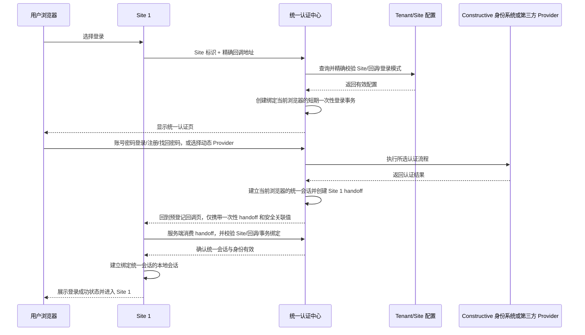
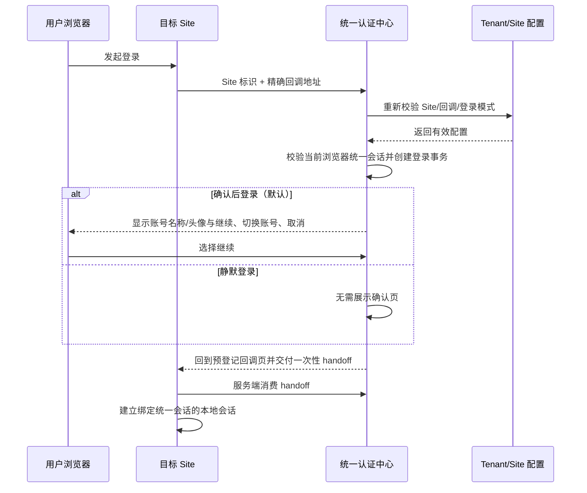
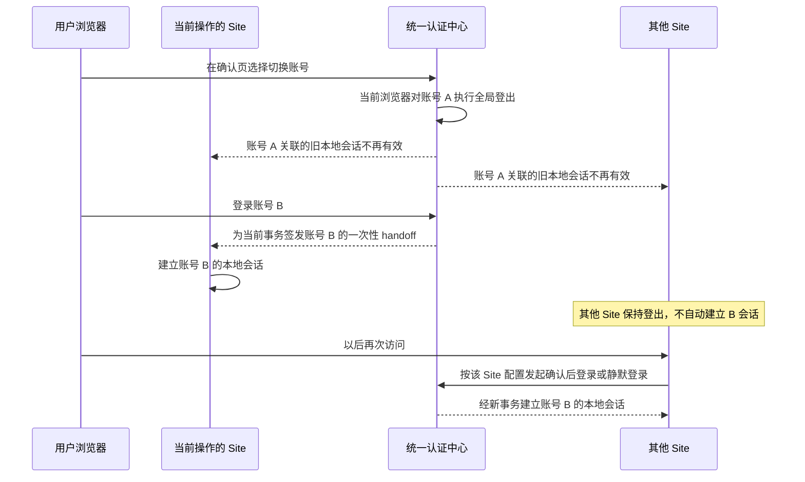

# 统一认证中心：已确认产品交互补充（草稿）

## 文档状态

本文档是
[`oauth-sso-platform-integration.md`](./oauth-sso-platform-integration.md)
的独立产品交互补充草稿，不替代其中已经确认的 OAuth、跨父域交接、请求上下文和安全边界。

本文档只记录后续已经确认的产品决定。原文档中仍将 logout 列为待确认项；本补充已确认“当前浏览器全局登出”及其会话行为，因此在该交互范围内以本补充为准。本补充也确认了首期 Constructive 本地账号注册后的会话行为。

## 产品定位

- Dashboard 是统一认证页面的承载平台，提供页面运行、品牌展示和用户交互所需的外壳。
- 统一认证中心是独立的认证能力，不依赖 Dashboard 的数据库管理、组织管理或其他管理功能才能工作。
- Tenant 管理认证能力的配置；Site 使用统一认证能力；Dashboard 不在页面代码中复制 Tenant、Site、Provider 或会话规则。
- 统一认证中心支持与目标 Site 不同的父域，不依赖跨父域共享 Cookie。

## 核心对象

### Tenant

Tenant 是 Site、第三方 Provider 和认证策略的管理边界。Tenant 管理员决定哪些 Site 可以接入、每个 Site 的允许回调地址，以及该 Site 使用确认后登录还是静默登录。

### Site

Site 是 Tenant 已注册的业务站点。

- 每个 Site 有稳定、唯一的站点标识。
- 一个 Site 可以登记多个允许的回调地址。
- 回调地址逐条登记并精确匹配，包括协议、主机、端口、路径和已登记的固定组成部分。
- 不允许通配符、仅按父域或后缀匹配，也不接受登录时临时传入但未登记的 URL。
- 浏览器传入的 Site 标识和回调地址只是请求参数，只有与 Tenant 配置精确匹配后才成为可信目标。

### 登录事务

登录事务是统一认证中心在 Site 与回调地址验收通过后创建的短期、一次性事务。

- 事务绑定 Tenant、Site、精确回调地址和当前浏览器。
- 后续确认、认证结果、handoff 和回调都必须匹配同一事务。
- 事务过期、已使用或任一绑定不匹配时不能继续，也不能降级到默认 Site 或默认回调。
- 登录成功后交给 Site 的仍是短期、一次性、服务端消费的 handoff code；它不是 access token 或 session token。

### 会话

- 统一会话属于当前浏览器与统一认证中心。
- Site 本地会话属于当前 Site，并绑定建立它的统一会话。
- 不同父域的 Site 各自维护本地 Cookie；它们不复制或共享统一认证中心的 Cookie。

## Tenant 可管理配置

### Site 注册

Tenant 管理员可以注册、更新、启用或停用 Site，并管理：

- 稳定 Site 标识；
- Site 基础识别信息；
- 一个或多个允许回调地址；
- 登录模式；
- 与 Site 登录有关的其他已定义策略。

停用的 Site 或已移除的回调地址立即失去发起新登录事务的资格。进行中的事务在最终回调或消费前仍需重新确认目标有效，不能仅依赖发起时的旧配置。

### 登录模式

每个 Site 由 Tenant 配置以下一种模式：

- **确认后登录（默认）：** 当前浏览器已有有效统一会话时，认证中心仍显示轻量确认页；用户确认后才向该 Site 建立本地会话。
- **静默登录：** 当前浏览器已有有效统一会话、Site 和事务仍可信且没有其他交互要求时，认证中心不显示确认页，直接完成安全交接。

未配置时必须使用确认后登录，不能因历史行为、Site 类型或前端参数自动变成静默登录。

## 统一认证中心页面与入口

本节描述逻辑入口和页面职责，不在本草稿中固定最终 HTTP 路径名称。

### Site 登录入口

Site 将浏览器带到统一认证中心，并携带 Site 标识、请求的精确回调地址及安全关联所需的公开参数。认证中心先按 Tenant 配置验收 Site 与回调地址，再创建登录事务。

### 统一认证页

统一认证页始终提供：

- Constructive 自身账号密码登录；
- Constructive 自身账号注册；
- Constructive 自身账号找回密码；
- 当前 Tenant 已配置并启用的第三方 Provider。

第三方 Provider 列表从当前 Tenant 的配置及已有公共实现动态读取。页面代码不得写死 Google、GitHub 或其他 Provider 名单；新增、停用或更改 Provider 不应要求复制一套页面登录流程。

### 已登录确认页

确认后登录模式下，确认页保持轻量，只帮助用户确认“当前将使用哪个账号继续”：

- 显示当前账号的名称、头像等基础识别信息；
- 提供“继续”；
- 提供“切换账号”；
- 提供“取消”。

确认页不展示冗长权限说明，不把 Site 的权限、角色或数据访问范围伪装成认证中心的授权同意页。

### 通用失败页

当认证中心无法确认可信目标 Site，或者登录事务、状态、回调绑定已失去可信性时，浏览器停留在认证中心的通用失败页。失败页只显示安全、通用的说明和可恢复操作，不尝试回跳到不可信地址。

### Site 回调页

Site 使用预登记的同一回调页接收可安全回传的结果，并由 Site 自己展示最终状态：

- 成功；
- 用户取消；
- 目标仍可信时可安全归类的失败。

回调不得携带第三方原始报错、第三方 token、Constructive access/session token、Cookie、Provider 原始响应或其他敏感信息。成功结果只携带完成服务端交接所需的一次性 handoff 和安全关联值；取消或失败只携带稳定、无敏感信息的结果分类。

## 核心时序

### Site 1 首次发起，当前浏览器没有统一会话

若用户取消或出现目标仍可信、可安全归类的失败，认证中心回到 Site 1 的同一预登记回调页，由 Site 1 展示取消或失败状态。

### 已有统一会话时访问 Site

静默登录只省略确认页，不省略 Site/回调验收、登录事务、统一会话校验、一次性交接或 Site 本地会话绑定。

### 账号切换

切换账号的含义是当前浏览器从账号 A 完整切换到账号 B，而不是让两个账号的 Site 会话同时有效。

切换账号不会后台批量登录其他 Site，也不会保留账号 A 的旧本地会话继续访问。

## 结果与异常流程

### 可以安全回到 Site 的结果

只有在认证中心仍能确认登录事务、Site 和精确回调地址可信时，以下结果才能回到预登记回调页：

- **成功：** 返回一次性 handoff，由 Site 服务端消费后建立本地会话。
- **用户取消：** 返回稳定的取消状态，不创建 handoff 或本地会话。
- **安全可归类失败：** 例如在可信事务内发生的凭据失败、Provider 拒绝或内部已安全映射的业务失败；只返回稳定分类，不返回第三方原始细节。

Site 负责在同一回调页展示对应状态。认证中心不为成功、取消和每类安全失败要求不同的回调 URL。

### 必须留在认证中心的失败

以下情况不能回跳，因为认证中心已无法安全信任目标：

- 登录事务过期或已经使用；
- state、事务关联值或浏览器绑定被篡改或不匹配；
- 回调地址与事务绑定或当前 Site 配置不一致；
- Site 不存在、被停用、归属不匹配或无法解析；
- Site 或回调在事务进行期间被移除，且最终校验不再通过；
- 任何其他无法确认可信目标 Site 的情况。

这些情况统一停留在认证中心的通用失败页，不使用请求中携带的地址进行“尽力回跳”。

## 防篡改与信任模型

1. Tenant 管理的 Site 和精确回调白名单是目标信任根。
2. 认证中心先验收 Site 与回调，再创建登录事务；不能先接受任意 return URL，完成登录后再判断。
3. 登录事务绑定 Site、精确回调地址和当前浏览器，且短期、一次性。
4. 每一步结果都必须对应同一事务；Provider callback、确认操作、handoff 签发和 Site 消费不得替换目标。
5. Site 在消费 handoff 前重新确认自身身份、回调和事务绑定。
6. 已消费、过期、复制到其他浏览器或 Site、修改回调的事务或 handoff 一律拒绝。
7. 不使用通配符、相似域名、父域后缀、CORS allowlist、来源页面或客户端数据库 ID 来替代 Site 精确注册。
8. 校验失败不能回退到默认 Tenant、默认 Site、默认数据库或临时 URL。

具体签名、存储、哈希、TTL 数值和浏览器绑定载体属于后续技术设计，但不能削弱上述可观察行为。

## 会话校验与当前浏览器全局登出

### Site 本地会话约束

- Site 本地会话记录或可验证地引用建立它的统一会话。
- Site 在每次受保护请求上校验对应统一会话仍然有效。
- 统一会话被撤销后，所有绑定它的 Site 本地会话都必须拒绝继续访问，即使 Site 自己的本地 Cookie 尚未自然过期。
- Site 不依赖浏览器跨父域读取认证中心 Cookie；校验通过服务端拥有的可信会话边界完成。

### 全局登出

- “全局登出”只作用于当前浏览器的统一会话及其绑定的 Site 本地会话。
- 其他浏览器或设备的会话不在本次操作范围内。
- 统一会话撤销后，各 Site 在下一次受保护请求时拒绝旧本地会话。
- 不为 Site 引入登出通知地址，也不要求认证中心逐站点发送浏览器回调或 webhook 才能完成撤销。

## Constructive 本地账号能力

- 账号密码登录、注册和找回密码是统一认证页的常驻入口，不因 Tenant 没有配置第三方 Provider 而消失。
- 第三方 Provider 是动态补充方式，不替代 Constructive 本地账号能力。
- 本地账号成功认证后与第三方认证进入同一统一会话、确认/静默决策、handoff 和 Site 本地会话流程。
- 首期本地账号密码注册成功后，立即建立当前浏览器的统一认证会话，并继续完成发起注册的原 Site 登录事务、handoff 和本地会话建立。
- 首期不要求邮箱验证作为注册后建立统一会话或后续密码登录的前置条件。

## 验收标准

1. Dashboard 管理功能不可用或未进入管理页面时，统一认证页仍可作为独立能力完成认证流程。
2. Tenant 可注册 Site、登记多个精确回调地址并选择确认后登录或静默登录；新 Site 默认确认后登录。
3. 未登记、通配符匹配、相似域名或临时回调 URL 无法创建有效登录事务。
4. 统一认证页始终包含 Constructive 登录、注册和找回密码，Provider 列表完全来自当前 Tenant 动态配置与公共实现。
5. 确认页只展示基础账号识别信息以及继续、切换账号、取消操作。
6. Site 1 的成功、取消和仍可信的安全分类失败回到同一预登记回调页，并且不泄漏原始 Provider 错误、token 或敏感信息。
7. 事务过期、状态/回调篡改或目标无法信任时，浏览器停留在认证中心通用失败页。
8. 登录事务和 handoff 均为短期、一次性，并绑定正确 Site、精确回调和当前浏览器；重放或跨 Site/浏览器使用失败。
9. 确认后登录与静默登录只在是否显示确认页上不同，不削弱任何目标、事务、会话或 handoff 校验。
10. 当前浏览器全局登出撤销统一会话后，所有绑定的 Site 本地会话在受保护请求上被拒绝；不依赖 Site 通知地址。
11. 切换账号会先让账号 A 在当前浏览器全局登出，只为当前操作 Site 建立账号 B 会话；其他 Site 保持登出，直到下次按各自配置重新经过认证中心。
12. 本地账号密码注册成功后无需先完成邮箱验证，即可建立统一会话并继续原 Site 的登录流程。

## 明确不采用

- 依赖共享父域 Cookie 的跨 Site SSO；
- 回调地址通配符、父域后缀信任或登录时临时 URL；
- 在页面代码中写死第三方 Provider 名单；
- 在回调 URL 中携带 access token、session token、第三方 token、原始错误或用户敏感信息；
- 目标不可信时仍尝试回跳；
- 冗长权限说明式确认页；
- Site 登出通知地址、逐 Site 回调或 webhook；
- 切换账号时自动为所有 Site 建立新账号会话。
