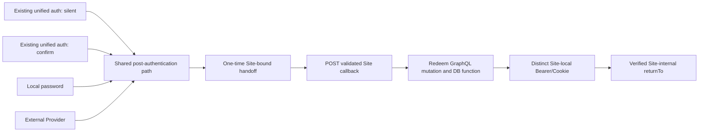

# OAuth/SSO Platform Integration Technical Specification

## Document Status

This document is the technical design specification for the unified authentication center. It records confirmed design decisions; unresolved proposals remain in the adjacent working draft until they are explicitly confirmed.

## Product Requirements Source

The product requirements and expected user-visible behavior are defined in [`docs/plan/oauth-sso-platform-integration.md`](../plan/oauth-sso-platform-integration.md). This specification will describe how those requirements are implemented without redefining them.

Working proposals, suggested values, evidence, and unresolved alternatives belong in the adjacent [working draft](./oauth-sso-platform-integration-draft.md). Only confirmed decisions should be promoted into this document.

## Goals and Scope

- Integrate external Providers through one protocol-neutral adapter boundary rather than duplicating the unified-login workflow per Provider.
- Reuse the existing Constructive identity association and provisioning capabilities.
- Make every successful authentication method converge on one Site handoff and local-credential completion path.

## Architecture and Trust Boundaries

- Dashboard owns authentication-center presentation and sends the active unified login transaction identifier only to Constructive.
- Constructive owns generic SSO orchestration, OAuth authorization-request state, Provider adapter selection, normalized identity consumption, and transition into shared post-authentication completion.
- A protocol-neutral Provider Adapter contract covers Provider-specific authorization initiation and callback/code-to-normalized-identity completion. Google and GitHub each implement the contract; future Providers add another adapter. This decision requires neither an abstract base class nor inheritance.
- Google/OIDC identity-token validation and GitHub/OAuth exchange or optional profile/email retrieval are adapter-internal examples, not generic SSO requirements. Login-transaction and state validation, account matching or provisioning, and shared handoff orchestration remain in the common Constructive service outside the adapters.
- Constructive DB owns durable identity association and the existing identity procedures. The browser and external Provider are outside the trusted transaction boundary.

## Login Transactions

Dashboard supplies the active opaque unified login transaction identifier and selected configured Provider to Constructive. Constructive creates an existing OAuth authorization request and associates it with that transaction server-side. Only a separate cryptographically random OAuth state value crosses the browser/Provider boundary; the unified login transaction identifier never does.

On callback, Constructive validates and consumes OAuth state before restoring the configured Provider and original unified login transaction. The callback may contain a code or Provider error, but neither is accepted without valid server-side state.

## Authentication Center and Site Sessions

Every successful route enters exactly one shared post-authentication path. Reused unified authentication may enter after silent Site handling or explicit account confirmation; local password and every supported external Provider enter after their authentication and identity resolution complete.



## Handoff Codes and Callbacks

Constructive creates the Site-bound, short-lived, one-time handoff from the shared post-authentication path. Dashboard delivers the handoff code to the already validated technical Site callback through browser `POST`, never in a URL.

The target Site server calls the Constructive redeem-handoff GraphQL mutation backed by the handoff-redemption PostgreSQL function. Successful redemption consumes the handoff and returns a distinct Site-local credential plus the verified Site-internal, application-relative `returnTo`. The Site callback owns setting its first-party Cookie and delivering its Bearer result to its frontend before redirecting to `returnTo`.

## Provider Integration

The Provider Adapter normalizes every successful Provider result to the same minimal external identity:

- Provider service key or name;
- stable Provider user identifier or subject;
- email when available; and
- safe profile details.

Generic SSO consumes only this normalized outcome. Provider-specific OAuth/OIDC exchange, verification, and optional profile retrieval remain within the selected adapter. Provider authorization codes are transient protocol inputs and are never stored or treated as identity.

The Google/OIDC adapter exchanges the authorization code server-side, validates the returned identity token as identity proof, and normalizes the resulting user data. A returned access token is not retained or used for v1 SSO when validated identity data is sufficient. The GitHub/OAuth adapter exchanges the authorization code server-side for an access token, uses it server-side to retrieve GitHub user and, when necessary, email data, and normalizes the result. These are adapter-internal examples; they do not create Provider-specific top-level SSO flows. The browser receives only an authorization code plus OAuth state, or a Provider error, and never receives Provider tokens.

Durable association uses `constructive_user_identifiers_private.connected_accounts`: Provider `service` plus stable `identifier` resolves `owner_id`, while other safe profile attributes remain in `details`. Email is not the returning-account key.

- An existing association authenticates its linked local user.
- An unlinked identity whose normalized email is not owned by a local account follows the existing `sign_up_identity` path, atomically provisioning the application user, email, and connected account.
- An unlinked identity whose normalized email belongs to a different local account fails explicitly with guidance to use the existing sign-in method. This flow performs no automatic merge or binding and no password-confirmation linking.

```mermaid
sequenceDiagram
    participant D as Dashboard
    participant C as Common Constructive SSO service
    participant DB as Constructive DB
    participant PA as Protocol-neutral Provider Adapter
    participant B as Browser
    participant IP as External Identity Provider
    participant P as Shared post-authentication path

    D->>C: Provider start with transaction ID and configured Provider
    C->>DB: Create OAuth request linked to unified transaction
    DB-->>C: Random OAuth state; PKCE/nonce remain server-side
    C->>PA: Build Provider-specific authorization request
    C-->>B: Redirect with random OAuth state only
    B->>IP: Complete Provider interaction
    IP-->>B: Callback with code or error and OAuth state
    B->>C: Provider callback
    C->>DB: Validate state and restore Provider + unified transaction
    C->>PA: Handle callback through configured adapter
    alt Google/OIDC adapter example
        PA->>IP: Exchange authorization code server-side
        IP-->>PA: Identity token + optional access token + user data
        PA->>PA: Validate identity token and normalize user data
        Note over PA,IP: Optional access token is not retained or used for v1 SSO when identity data is sufficient
    else GitHub/OAuth adapter example
        PA->>IP: Exchange authorization code server-side
        IP-->>PA: Access token
        PA->>IP: Query GitHub user and optional email endpoints
        IP-->>PA: User and optional email data
        PA->>PA: Normalize GitHub user data
    else Another supported adapter
        PA->>PA: Run adapter-specific verification and normalize
    end
    Note over B,IP: Browser receives code/state or error, never Provider tokens
    alt Provider flow fails
        PA-->>C: Classified failure
        C-->>D: Safe failure; restart from Site login entry
    else Normalized external identity
        PA-->>C: Service + stable identifier + optional email + safe profile
        C->>DB: Resolve connected_accounts by service + identifier
        alt Existing association
            DB-->>C: Linked local user
            C->>P: Continue with linked identity and transaction
        else Unlinked and email is unowned
            C->>DB: Call existing sign_up_identity path
            DB-->>C: Provisioned user + email + connected account
            C->>P: Continue with provisioned identity and transaction
        else Email belongs to another local account
            DB-->>C: Explicit account conflict
            C-->>D: Use existing sign-in method; restart login
        end
    end
```

### Future consideration (not current scope)

An already authenticated local user may later bind Google, GitHub, or another Provider from account settings. Account-settings binding is not part of the current unified-login flow.

## Routes and Interfaces

- Provider authorization initiation and callback retain browser HTTP semantics. The callback accepts a Provider code or error only together with valid opaque OAuth state.
- Dashboard never sends the unified login transaction identifier to an external Provider.
- Target Site handoff redemption uses a Constructive GraphQL mutation backed by a PostgreSQL function.

## Data Model

- The existing `constructive_user_identifiers_private.connected_accounts` relation remains the durable Provider association; no parallel Provider-identity table is introduced.
- `service` plus stable external `identifier` identifies the connected account and maps to `owner_id`. Safe non-key Provider profile attributes remain in `details`.
- OAuth authorization-request state remains transient and server-side. A Provider authorization code is never persisted as an identity key.

## Errors and Observability

Provider cancellation, a Provider-reported error, invalid OAuth state, exchange or verification failure, and existing-email account conflict produce safe, explicit user-facing failures without exposing raw Provider details. The failed Provider flow is not resumed; the user must restart from the Site login entry with a new unified login transaction.

## Security

- Unified login transaction identifiers stay within Dashboard-to-Constructive operations. Browser redirects carry only random OAuth state.
- Stable Provider identifier, not email or authorization code, is the durable identity key.
- An email collision never authorizes automatic account merge, binding, or password-confirmation linking.
- All successful Provider branches use the same Site-bound handoff, POST callback, redemption, Site-local credential, and verified `returnTo` path as local authentication and reused unified sessions.

## Testing and Migration

Coverage must verify transaction-ID/OAuth-state separation, adapter normalization, existing connected-account login, `sign_up_identity` provisioning, email-conflict rejection, Provider failure restart, and convergence into the shared handoff path. Existing identity association data remains authoritative; no migration to a parallel identity store is permitted.

## Open Design Items

Design questions remain in the working draft until they are resolved. This section will track only unresolved items that have been explicitly accepted as part of the formal specification review.
