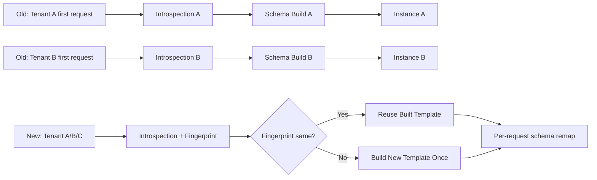
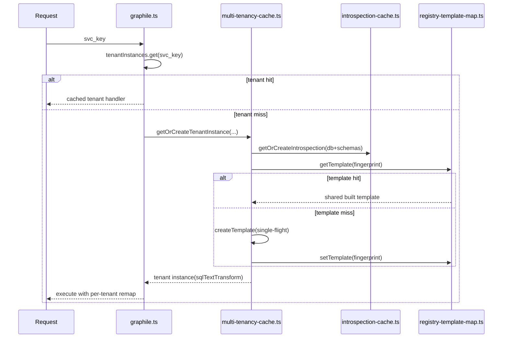

# Multi-Tenancy Cache Architecture

## The Problem

In a multi-tenant PostGraphile deployment, each tenant has its own database schema (e.g., `tenant_a`, `tenant_b`). The **old approach** builds a completely separate PostGraphile instance for every tenant — each with its own introspection, schema build, GraphQL schema, and operation plan cache. This works, but memory and startup time grow linearly with tenant count.

## Old Approach: One Instance Per Tenant

Every tenant request triggers a full pipeline: introspect the database, build the GraphQL schema, and create a dedicated PostGraphile instance. Even though most tenants have **structurally identical** schemas (same tables, columns, types — just different schema names), the system treats them as completely independent.

**Old (top):** Each tenant gets its own full pipeline — introspection, schema build, and instance. At 20 tenants, that's 20 separate PostGraphile instances in memory.

**New (bottom):** Tenants are introspected and fingerprinted. If the structure matches, they **share a single built template**. The only per-request work is a lightweight schema name remap (`sqlTextTransform`).

### Why the old approach is expensive

| Tenant Count | Instances | Schema Builds | Memory (RSS) | Cold Start (2nd+ tenant) |
|---|---|---|---|---|
| 10 | 10 | 10 | ~500 MB | ~400 ms each |
| 20 | 20 | 20 | ~2 GB | ~400 ms each |
| 100 | 100 | 100 | ~10 GB | ~400 ms each |

Each PostGraphile instance holds: a parsed introspection, a compiled GraphQL schema, operation plan caches, and Grafast execution state. Most of this is **identical** across tenants with the same table structure.

## New Approach: Template-Based Sharing

The key insight: if two tenants have the same tables, columns, types, and constraints (just under different schema names), they can **share a single compiled PostGraphile template**. At query time, we simply remap schema names in the generated SQL — a single-pass regex replacement that costs ~0ms.

### How It Works

#### Step-by-step:

1. **Request arrives** with a `svc_key` (identifies the tenant + endpoint combination).

2. **Check tenant cache** (`graphile.ts`): If we've seen this tenant before, return the cached handler immediately (zero overhead).

3. **Cache miss → Introspect** (`introspection-cache.ts`): Query `pg_catalog` to discover the tenant's tables, columns, types. Results are cached by `(dbname, schemas)` — if another endpoint for the same tenant already fetched this, we reuse it.

4. **Fingerprint**: Generate a structural SHA-256 hash of the introspection result, **ignoring schema names**. Two tenants with identical table structures but different schema names (`tenant_a.users` vs `tenant_b.users`) produce the **same fingerprint**.

5. **Check template map** (`registry-template-map.ts`): If a template with this fingerprint already exists, **reuse it** — skip the expensive schema build entirely. The 2nd through Nth tenants with the same structure get instant reuse (~0-6ms vs ~400ms+).

6. **Template miss → Build once** (`multi-tenancy-cache.ts`): Build a PostGraphile instance using placeholder schema names (`__pgmt_tenant_a__pgmt_` → opaque wrappers). This is the only expensive operation, and it happens **once per unique structure**, not once per tenant.

7. **Return with `sqlTextTransform`**: Each tenant gets a lightweight transform function that remaps placeholder schema names to actual tenant schema names in the generated SQL. This is a single-pass regex replacement — essentially free.

### The Three Cache Layers

| Cache | Key | What it stores | Eviction |
|---|---|---|---|
| **Tenant Instance** (`graphile.ts`) | `svc_key` | Handler + sqlTextTransform | LRU (max 15) |
| **Introspection** (`introspection-cache.ts`) | `dbname:schema1,schema2` | Parsed pg_catalog + fingerprint | Idle TTL (30min) + max cap (100) |
| **Template** (`registry-template-map.ts`) | `fingerprint` (SHA-256) | Full PostGraphile instance | Idle TTL (30min) + max cap (50), ref-counted |

### Single-Flight Protection

Both introspection fetching and template creation use a **single-flight pattern**: if 5 concurrent requests arrive for the same new tenant, only 1 actually does the work. The other 4 await the same promise. On failure, the lock is released via `try/finally` so retries can proceed.

## Benchmark Results

### E2E GraphQL Benchmark (k=20, `apiIsPublic=false`, 5 min, real HTTP traffic)

| Metric | Old (Dedicated) | New (Multi-Tenancy) | Improvement |
|---|---|---|---|
| **QPS** | 13 | 740 | **57× faster** |
| **p50 Latency** | 212 ms | 12 ms | **18× faster** |
| **p99 Latency** | 2,559 ms | 24 ms | **107× faster** |
| **Heap Growth** | +781 MB | +74 MB | **10.6× less** |
| **RSS End** | 1,955 MB | 594 MB | **70% less** |
| **Schema Builds** | 1,110 | 0 | **eliminated** |
| **Errors** | 0 | 0 | — |

### Why is the old approach so slow at k=20?

The old approach uses an LRU cache with max 15 slots, but k=20 means 20 tenants competing for 15 slots. This causes **constant eviction and rebuild** — 1,110 schema builds in 5 minutes. Each rebuild blocks the request that triggered it (~400ms), causing the terrible p50=212ms and QPS=13.

The new approach built **zero** schemas during the sustained load test. The single template was built during warmup and shared by all 20 tenants. Per-request overhead is just the `sqlTextTransform` regex replacement (~0ms).

### Memory at Scale

| Tenants | Old RSS | New RSS | Savings |
|---|---|---|---|
| 10 | ~500 MB | ~340 MB | 32% |
| 20 | ~2 GB | ~600 MB | 70% |
| 100 (projected) | ~10 GB | ~800 MB | 92% |

Memory savings scale linearly: ~0.78 MB saved per additional tenant that shares a template.

## Summary

| | Old Approach | New Approach |
|---|---|---|
| **Memory** | O(N × schema_size) | O(K × schema_size), K = unique structures |
| **Build time** | Every tenant builds its own schema | Build once per unique structure, reuse for all |
| **Per-request cost** | Full PostGraphile instance routing | Single-pass regex remap (~0ms) |
| **Cache eviction** | Constant churn at scale (LRU=15 < N) | Template stays as long as any tenant uses it |
| **Introspection** | Every tenant introspects independently | Shared cache, 67% fewer pg_catalog queries |
| **Failure handling** | N/A | Single-flight + try/finally, retry-safe |

In production with typical multi-tenant setups where all tenants share the same schema structure (K=1), the new approach reduces memory from **O(N)** to **O(1)** and eliminates schema build overhead entirely after the first tenant.
